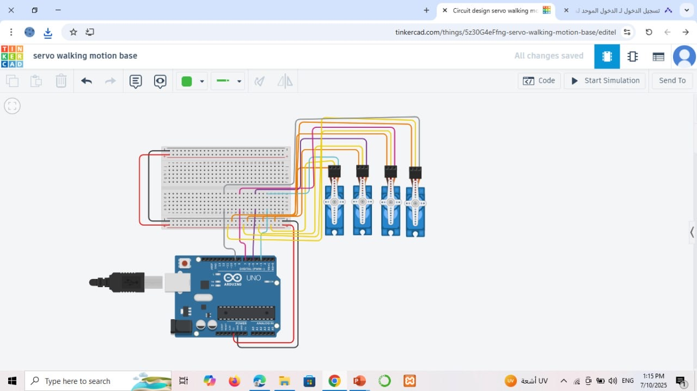
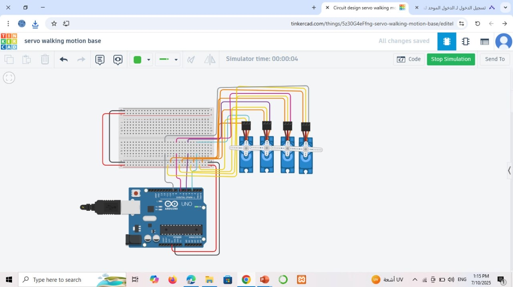

# 🤖 Servo Walking Motion Base – Task 2

This project demonstrates the basic sweep behavior and angle control of 4 servo motors using Arduino UNO and Tinkercad, serving as the foundation for **walking motion executed in a humanoid robot**.

---

## 🎯 Objective

- Run 4 servo motors using the **Sweep** example for 2 seconds.  
- After that, make all motors hold at **90 degrees**.  
- Write a basic algorithm that simulates walking motion for a humanoid robot.

---

## 🖼️ Circuit Design

### ✅ Circuit Setup  


### ✅ Simulation Running  


---

## 📜 Walking Motion Algorithm

1️⃣ Start the system

2️⃣ Initialize 4 servo motors:
🔸 2 for legs → (left_leg, right_leg)
🔸 2 for feet → (left_foot, right_foot)

3️⃣ Set all servos to neutral position → 90°

🔁 Repeat to simulate walking:

🦵 Right leg step:
→ Lift right_leg to 60°
→ Tilt right_foot forward to 120°
→ Move right_leg forward to 30°
→ Return both to 90°

🦵 Left leg step:
→ Lift left_leg to 60°
→ Tilt left_foot forward to 120°
→ Move left_leg forward to 30°
→ Return both to 90°

🔂 Keep repeating for continuous walking

✅ End

---


## 💻 Arduino Code

```cpp
// ryoof almalki

#include <Servo.h>

Servo servoo0;
Servo servoo1;
Servo servoo2;
Servo servoo3;

void setup() {
  servoo0.attach(3);   
  servoo1.attach(5);
  servoo2.attach(7);
  servoo3.attach(9);
}

void loop() {
  for (int pos = 0; pos <= 180; pos++) {
    servoo0.write(pos);
    servoo1.write(pos);
    servoo2.write(pos);
    servoo3.write(pos);
    delay(12);  
  }

  servoo0.write(90);
  servoo1.write(90);
  servoo2.write(90);
  servoo3.write(90);

  while (true); 
}

```

 ---
## Created by
🪄 Ryoof Dukhailallah Almalki 🪄
